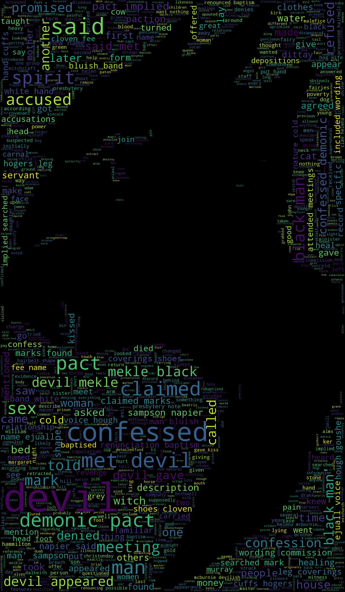

# Witches

This is purely a 'for fun' project with a cool dataset on the history of Scottish witchcraft I've found on data.world back in January. It contains various data (40 tables) about people accused, tried and executed for witchcraft in 16-17 century Scotland. I used it for a while to practice SQL since the data is organized in a relational format. For this project I've decided to look at the witches dataset more closely and create couple visualizations of the data. I think it could also be cool to create a network graph of all the relationships within the database, but maybe next time.

### Word Clouds
There is a lot of text describing charges and accusations the "witches" faced during their trials, so I thought it would be cool to produce some word clouds that would show most frequently encountered words in the notes about those charges. I realized that there are two types of interesting info: notes about the actual accusations, and notes about "devil" (any unnatural creature) encounters. That led me to 2 word clouds:

  

  

### Some Distributions
Apparently out of 3170 accused, 2702 were women and 468 were men. I know, *shocking!* lol. Besides the accused themselves, there is a Devil Appearance table that contains data about people encountering "unnatural" beings and bringing it up during the trial. I looked at the distribution of the types of those "devils", and found that the vast majority was "Male"...

Another distribution I looked at was accused by their county of residence. The top three counties are all next to each other, and were probably the most populated, which would explain higher numbers of accused witches.

